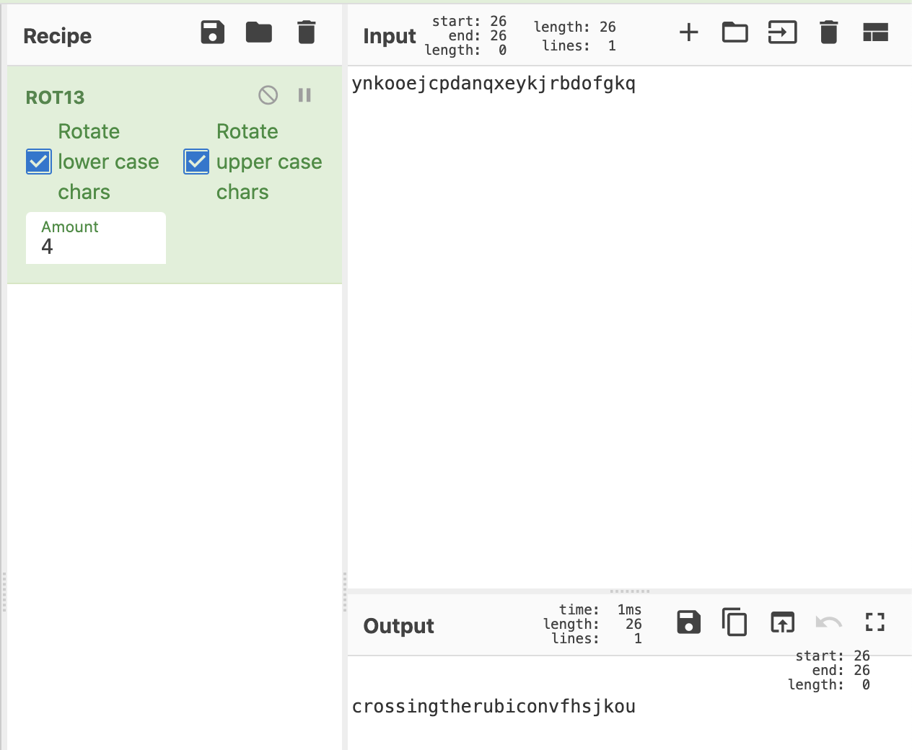
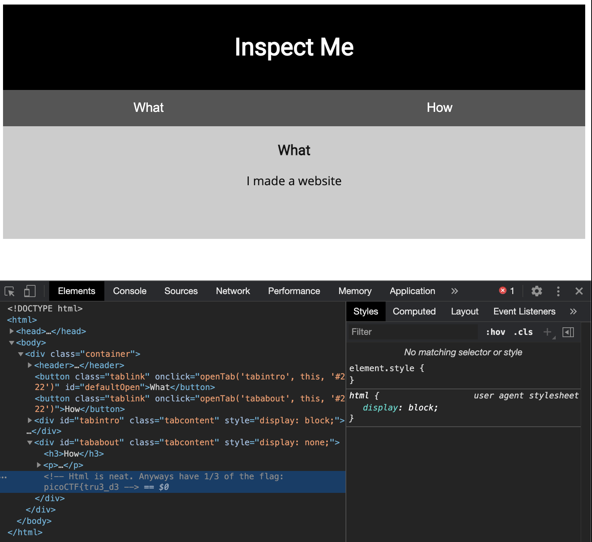
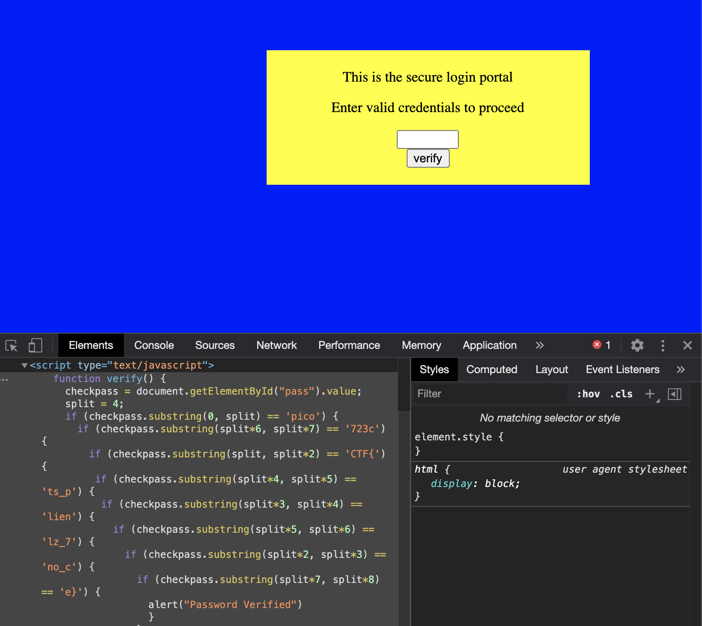

# PicoCTF - PicoGym Challenges

PicoCTF is a free computer security game with original educational content built on a capture-the-flag framework created by security and privacy experts at Carnegie Mellon University. The competition has participants reverse engineer, break, hack, decrypt, and think creatively and critically to solve the challenges and capture the flags.

The following are questions that can be found on the new picoGym challenges page. They include solutions for the picoCTF 2019 competition and picoCTF 2020 mini competition.


## Overview


Title | Category | Points | Flag
------|----------|--------|-----
[Lets Warm Up ](#general-skills-lets-warm-up) | General Skills | 50 | `picoCTF{p}`
[2Warm ](#general-skills-2warm) | General Skills | 50 | `picoCTF{101010}`
[Warmed Up ](#general-skills-warmed-up) | General Skills | 50 | `picoCTF{61}`
[Bases ](#general-skills-bases) | General Skills | 100 | `picoCTF{l3arn_th3_r0p35}`
[First Grep ](#general-skills-first-grep) | General Skills | 100 | `picoCTF{grep_is_good_to_find_things_f77e0797}`
[The Numbers ](#cryptography-the-numbers) | Cryptography | 50 | `picoCTF{THENUMBERSMASON}`
[Caesar ](#cryptography-caesar) | Cryptography | 100 | `picoCTF{crossingtherubiconvfhsjkou}`
[Insp3ct0r ](#web-exploitation-insp3ct0r) | Web Exploitation | 50 | `picoCTF{tru3_d3t3ct1ve_0r_ju5t_lucky?f10be399}`
[Dont Use Client Side ](#web-exploitation-dont-use-client-side) | Web Exploitation | 100 | `picoCTF{no_clients_plz_7723ce}`
[Vault Door Training ](#reverse-engineering-vault-door-training) | Reverse Engineering | 50 | `picoCTF{w4rm1ng_Up_w1tH_jAv4_be8d9806f18}`
[Glory of the Garden ](#forensics-glory-of-the-garden) | Forensics | 50 | `picoCTF{more_than_m33ts_the_3y3eBdBd2cc}`

---

## General Skills: Lets Warm Up

**Challenge**

If I told you a word started with 0x70 in hexadecimal, what would it start with in ASCII?

**Solution**

This is really easy to do in bash as the command `echo` has the ability to interpret backslashes, you can also use a tool like `xxd` to make a hexdump or reverse it with the -r option.

```console
z3r0@disboard:~$ echo -e '\x70'
p
z3r0@disboard:~$ echo '0x70' | xxd -r
p%
```

It can also be done in python using the 'decode' command and passing in the type argument as 'hex'.

```python
>>> '70'.decode('hex')
p
```

**Flag**
```
picoCTF{p}
```

[Back to Top](#overview)

---

## General Skills: 2Warm

**Challenge**

Can you convert the number 42 (base 10) to binary (base 2)?

**Solution**

This can be easily converted by hand but the process can be simplified for any n using bash or python. In bash, you can utilize the `bc` command tool which takes a string as input to calculate arbitrary precision numbers.

```console
z3r0@disboard:~$ echo "obase=2; 42 | bc"
101010
```

In python, there is a built-in command called 'bin' that will return a binary string starting with '0b'.

```python
>>> bin(42)[2:]
'101010'
```

**Flag**
```
picoCTF{101010}
```

[Back to Top](#overview)

---

## General Skills: Warmed Up

**Challenge**

What is 0x3D (base 16) in decimal (base 10)?

**Solution**

Once again, we can use bash's bc function or python to do this conversion.

```console
z3r0@disboard:~$ echo "obase=10; ibase=16; 3D" | bc
61
```

```python
>>> int('3d', 16)
61
```

**Flag**
```
picoCTF{61}
```

---

## General Skills: Bases

**Challenge**

What does this `bDNhcm5fdGgzX3IwcDM1` mean? I think it has something to do with bases.

**Solution**

Using the title as a hint, first thoughts go to a base64 encoded string. To decode it, you can use the `base64` bash tool along with the `echo command`

```console
z3r0@disboard:~$ echo bDNhcm5fdGgzX3IwcDM1 | base64 -d
l3arn_th3_r0p35
```

Its also possible to do it in python, though an external package 'base64' needs to be imported to utilized the base64 decoder.

```python
>>> import base64
>>> base64.b64decode('bDNhcm5fdGgzX3IwcDM1')
'l3arn_th3_r0p35'
```

**Flag**
```
picoCTF{l3arn_th3_r0p35}
```

[Back to Top](#overview)

---

## General Skills: First Grep

**Challenge**

Can you find the flag in this `file`? This would be really tedious to look through manually, something tells me there is a better way.

**Solution**

Download linked file and rename it to something more accurate i.e. first-grep.txt

This challenge requires using the bash tool `grep` which is a utility that searches any given input file and selects lines that match one or more patterns. The general command for grep looks like the following: `grep [pattern] [file ...]`

```console
z3r0@disboard:~$ grep pico first-grep.txt
picoCTF{grep_is_good_to_find_things_f77e0797}
```

**Flag**
```
picoCTF{grep_is_good_to_find_things_f77e0797}
```

[Back to Top](#overview)

---

## Cryptography: The Numbers

**Challenge**

The numbers... what do they mean?
(The flag is in the format PICOCTF{})

**Solution**


String of numbers > 16 9 3 15 3 20 6 { 20 8 5 14 21 13 2 5 18 19 13 1 19 15 14 }
The numbers correspond with the order of the alphabet i.e. 1=A, 2=B, etc.

```python
>>> nums = '16 9 3 15 3 20 6 { 20 8 5 14 21 13 2 5 18 19 13 1 19 15 14 }'.split()
>>> flag = ''.join(chr(int(x)+64) if x.isnumeric() else x for x in nums)
>>> flag 
PICOCTF{THENUMBERSMASON}
```

**Flag**
```
picoCTF{THENUMBERSMASON}
```

---

## Cryptography: Caesar

**Challenge**

Decrypt this `message`.

**Solution**

The downloaded message looks like the following:
```text
picoCTF{ynkooejcpdanqxeykjrbdofgkq}
```

Since the title says 'Caesar', it's implied that this is a Caesar cipher. There are many available ways to decrypt a caesar message by hand or online such as at the website [CyberChef](https://gchq.github.io/CyberChef/). Using CyberChef, select the ROT13 (another name for Caesar cipher) recipe and paste the encoded part of the message into the 'Input' section.



We can also write a simple python script to achieve the same goal and output all the possibilities using the following [script](picoctf/caesar.py):
```python
#!/usr/bin/python3
import sys
message = input('Enter the string to be decrypted: ')
for key in range(26):
	result = ''
	for c in message:
		if c.isupper(): result += chr((ord(c) + key - 65) % 26 + 65)
		elif c.islower(): result += chr((ord(c) + key - 97) % 26 + 97)
		else: result += c 
	print(f'Using shift {key}: {result}')
```

Running this code will produce the following:
```console
z3r0@disboard:~$ python3 caesar.py
Enter the string to be decrypted: ynkooejcpdanqxeykjrbdofgkq
Using shift 0: ynkooejcpdanqxeykjrbdofgkq
...
Using shift 3: bqnrrhmfsgdqtahbnmuegrijnt
Using shift 4: crossingtherubiconvfhsjkou
Using shift 5: dspttjohuifsvcjdpowgitklpv
...
Using shift 26: ynkooejcpdanqxeykjrbdofgkq
```

**Flag**
```
picoCTF{crossingtherubiconvfhsjkou}
```

[Back to Top](#overview)

---

## Web Exploitation: Insp3ct0r

**Challenge**

Kishor Balan tipped us off that the following code may need inspection: https://jupiter.challenges.picoctf.org/problem/44924/ (link) or http://jupiter.challenges.picoctf.org:44924

**Solution**

Navigating to the given link, you're greeted with a simple html page that says 'Inspect Me'. On Chrome, you can open the inspector by either using the shortcut 'Option+Command+J' or by right clicking and then clicking the 'Inspect' option. Opening the inspector shows the following:



The first part of the flag is given in the HTML file > `picoCTF{tru3_d3`

Navigating to the 'Sources' tab, you can view the js and css to get the next part of the flags:
- mycss.css > `t3ct1ve_0r_ju5t`
- myjs.js > `_lucky?f10be399}`

Putting it all together makes `picoCTF{tru3_d3t3ct1ve_0r_ju5t_lucky?f10be399}`

**Flag**
```
picoCTF{tru3_d3t3ct1ve_0r_ju5t_lucky?f10be399}
```

[Back to Top](#overview)

---

## Web Exploitation: Dont Use Client Side

**Challenge**

Can you break into this super secure portal? https://jupiter.challenges.picoctf.org/problem/29835/ (link) or http://jupiter.challenges.picoctf.org:29835

**Solution**

On entry to the portal, there is a single input field that takes a password - first thing first is to check the inspector for any interesting information.



Opening the inspector, there's a verify function that receives the password string provided and compares it to pieces of the flag that are out of order - now all we need to do it put it back together. Putting the 8 parts together gives us the flag > `picoCTF{no_clients_plz_7723ce}`. 

Enter the flag as the password and if you receive an alert that says 'Password Verified' then you're good to go!

**Flag**
```
picoCTF{no_clients_plz_7723ce}
```

[Back to Top](#overview)

---

## Reverse Engineering: Vault Door Training

**Challenge**

Your mission is to enter Dr. Evil's laboratory and retrieve the blueprints for his Doomsday Project. The laboratory is protected by a series of locked vault doors. Each door is controlled by a computer and requires a password to open. Unfortunately, our undercover agents have not been able to obtain the secret passwords for the vault doors, but one of our junior agents obtained the source code for each vault's computer! You will need to read the source code for each level to figure out what the password is for that vault door. As a warmup, we have created a replica vault in our training facility. The source code for the training vault is here: [VaultDoorTraining.java](picoctf/VaultDoorTraining.java)

**Solution**

The java file has the following function:
```java
public boolean checkPassword(String password) {
	return password.equals("w4rm1ng_Up_w1tH_jAv4_be8d9806f18");
}
```
When the program takes the users input, it strips out the 'picoCTF{' and '}' sections, so the password for the vault would be `picoCTF{w4rm1ng_Up_w1tH_jAv4_be8d9806f18}`.

On macOS, you can test it by doing the following:
1. `javac VaultDoorTraining.java`
2. `java VaultDoorTraining`

```console
z3r0@disboard:~$ java VaultDoorTraining
Enter vault password: picoCTF{w4rm1ng_Up_w1tH_jAv4_be8d9806f18}
Access granted.
```

**Flag**
```
picoCTF{w4rm1ng_Up_w1tH_jAv4_be8d9806f18}
```

[Back to Top](#overview)

---

## Forensics: Glory of the Garden

**Challenge**

This garden contains more than it seems.

**Solution**


This problem can be solved in multiple ways, two I'll demonstrate use the `strings` command and the `hexdump` command.

```console
z3r0@disboard:~$ strings garden.jpg | grep pico
Here is a flag "picoCTF{more_than_m33ts_the_3y3eBdBd2cc}"
```
The `strings` command finds printable strings in an object while the `grep` command searches for strings with the pattern 'pico', the '|' character is a pipe and gives the ouput of the first command to the input of the second command.

```console
z3r0@disboard:~$ hexdump -C garden.jpg
...
00230550  a2 bb bd ac 96 87 98 e4  d3 b2 e8 7f ff d9 48 65  |..............He|
00230560  72 65 20 69 73 20 61 20  66 6c 61 67 20 22 70 69  |re is a flag "pi|
00230570  63 6f 43 54 46 7b 6d 6f  72 65 5f 74 68 61 6e 5f  |coCTF{more_than_|
00230580  6d 33 33 74 73 5f 74 68  65 5f 33 79 33 65 42 64  |m33ts_the_3y3eBd|
00230590  42 64 32 63 63 7d 22 0a                           |Bd2cc}".|
...
```
You can also view the file as a hexdump with the `hexdump` command which is used to filter and display files in a human readable specified format.

**Flag**
```
picoCTF{more_than_m33ts_the_3y3eBdBd2cc}
```

[Back to Top](#overview)

---

## Sample: Sample

**Challenge**

A

**Solution**

B

**Flag**
```
picoCTF{C}
```

[Back to Top](#overview)

---

## File Type References

File Reference: [Sample File](files/file.zip)

Image Reference: 

Image Reference 2: [Image 2](files/picture.png)
