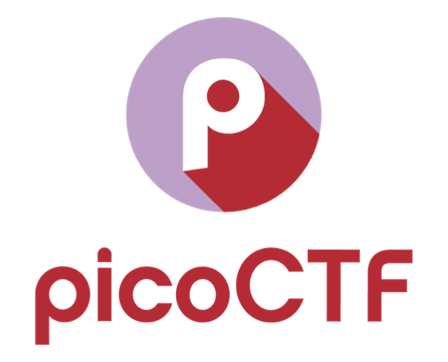

# PicoCTF - PicoGym Challenges

PicoCTF is a free computer security game with original educational content built on a capture-the-flag framework created by security and privacy experts at Carnegie Mellon University. The competition has participants reverse engineer, break, hack, decrypt, and think creatively and critically to solve the challenges and capture the flags.

The following are questions that can be found on the new picoGym challenges page. They include solutions for the picoCTF 2019 competition and picoCTF 2020 mini competition.



## Overview


Title | Category | Points | Flag
------|----------|--------|-----
[2Warm ](#general-skills-2warm) | General Skills | 50 | `picoCTF{101010}`
[Warmed Up ](#general-skills-warmed-up) | General Skills | 50 | `picoCTF{61}`
[The Numbers ](#cryptography-the-numbers) | Cryptography | 50 | `PICOCTF{THENUMBERSMASON}`
[Insp3ct0r ](#web-exploitation-insp3ct0r) | Web Exploitation | 50 | `picoCTF{tru3_d3t3ct1ve_0r_ju5t_lucky?f10be399}`
[Vault Door Training ](#reverse-engineering-vault-door-training) | Reverse Engineering | 50 | `picoCTF{w4rm1ng_Up_w1tH_jAv4_be8d9806f18}`
[Glory of the Garden ](#forensics-glory-of-the-garden) | Forensics | 50 | `picoCTF{more_than_m33ts_the_3y3eBdBd2cc}`


## General Skills: 2Warm

**Challenge**

Can you convert the number 42 (base 10) to binary (base 2)?

**Solution**

Can convert by hand, but to simplify process for any n, use bash or python

```console
z3r0@disboard:~$ echo "obase=2; 42 | bc"
101010
```

```python
>>> bin(42)[2:]
'101010'
```

**Flag**
```
picoCTF{101010}
```

## General Skills: Warmed Up

**Challenge**

What is 0x3D (base 16) in decimal (base 10)?

**Solution**

Once again, we can use bash's bc function or python to do this conversion

```console
z3r0@disboard:~$ echo "obase=10; ibase=16; 3D" | bc
61
```

```python
>>> int('3d', 16)
61
```

**Flag**
```
picoCTF{61}
```

## Cryptographhy: The Numbers

**Challenge**

The numbers... what do they mean?
(The flag is in the format PICOCTF{})

**Solution**


String of numbers > 16 9 3 15 3 20 6 { 20 8 5 14 21 13 2 5 18 19 13 1 19 15 14 }
The numbers correspond with the order of the alphabet i.e. 1=A, 2=B, etc.

```python
>>> nums = '16 9 3 15 3 20 6 { 20 8 5 14 21 13 2 5 18 19 13 1 19 15 14 }'.split()
>>> flag = ''.join(chr(int(x)+64) if x.isnumeric() else x for x in nums)
>>> flag 
PICOCTF{THENUMBERSMASON}
```

**Flag**
```
PICOCTF{THENUMBERSMASON}
```

## Web Exploitation: Insp3t0r

**Challenge**

Kishor Balan tipped us off that the following code may need inspection: https://jupiter.challenges.picoctf.org/problem/44924/ (link) or http://jupiter.challenges.picoctf.org:44924

**Solution**

Navigating to the given link, you're greeted with a simple html page that says 'Inspect Me' - on Chrome you can open the inspector by either using the shortcut 'Option+Command+J' or by right clicking and then clicking the 'Inspect' option - the inspector shows as follows:


The first part of the flag is given in the HTML file > `picoCTF{tru3_d3`
Navigating to the 'Sources' tab, you can view the js and css to get the next part of the flags:
- mycss.css > `t3ct1ve_0r_ju5t`
- myjs.js > `_lucky?f10be399}`

Putting it all together makes `picoCTF{tru3_d3t3ct1ve_0r_ju5t_lucky?f10be399}`

**Flag**
```
picoCTF{tru3_d3t3ct1ve_0r_ju5t_lucky?f10be399}
```

## Reverse Engineering: Vault Door Training

**Challenge**

Your mission is to enter Dr. Evil's laboratory and retrieve the blueprints for his Doomsday Project. The laboratory is protected by a series of locked vault doors. Each door is controlled by a computer and requires a password to open. Unfortunately, our undercover agents have not been able to obtain the secret passwords for the vault doors, but one of our junior agents obtained the source code for each vault's computer! You will need to read the source code for each level to figure out what the password is for that vault door. As a warmup, we have created a replica vault in our training facility. The source code for the training vault is here: [VaultDoorTraining.java](picoctf/VaultDoorTraining.java)

**Solution**

The java file has the following function:
```java
public boolean checkPassword(String password) {
	return password.equals("w4rm1ng_Up_w1tH_jAv4_be8d9806f18");
}
```
When the program takes the users input, it strips out the 'picoCTF{' and '}' sections, so the password for the vault would be `picoCTF{w4rm1ng_Up_w1tH_jAv4_be8d9806f18}`

On macOS, you can test it by doing the following:
1. `javac VaultDoorTraining.java`
2. `java VaultDoorTraining`

```console
z3r0@disboard:~$ java VaultDoorTraining
Enter vault password: picoCTF{w4rm1ng_Up_w1tH_jAv4_be8d9806f18}
Access granted.
```

**Flag**
```
picoCTF{w4rm1ng_Up_w1tH_jAv4_be8d9806f18}
```

## Category: Problem 5

**Challenge**

This garden contains more than it seems.

**Solution**


This problem can be solved in multiple ways, two I'll demonstrate use the `strings` command and the `hexdump` command

```console
z3r0@disboard:~$ strings garden.jpg | grep pico
Here is a flag "picoCTF{more_than_m33ts_the_3y3eBdBd2cc}"
```
The `strings` command finds printable strings in an object while the `grep` command searches for strings with the pattern 'pico', the '|' character is a pipe and gives the ouput of the first command to the input of the second command

```console
z3r0@disboard:~$ hexdump -C garden.jpg
...
00230550  a2 bb bd ac 96 87 98 e4  d3 b2 e8 7f ff d9 48 65  |..............He|
00230560  72 65 20 69 73 20 61 20  66 6c 61 67 20 22 70 69  |re is a flag "pi|
00230570  63 6f 43 54 46 7b 6d 6f  72 65 5f 74 68 61 6e 5f  |coCTF{more_than_|
00230580  6d 33 33 74 73 5f 74 68  65 5f 33 79 33 65 42 64  |m33ts_the_3y3eBd|
00230590  42 64 32 63 63 7d 22 0a                           |Bd2cc}".|
...
```
You can also view the file as a hexdump with the `hexdump` command which is used to filter and display files in a human readable specified format

**Flag**
```
picoCTF{more_than_m33ts_the_3y3eBdBd2cc}
```

## Sample: Sample

**Challenge**

A

**Solution**

B

**Flag**
```
picoCTF{C}
```


## File Type References

File Reference: [Sample File](files/file.zip)

Image Reference: 

Image Reference 2: [Image 2](files/picture.png)
